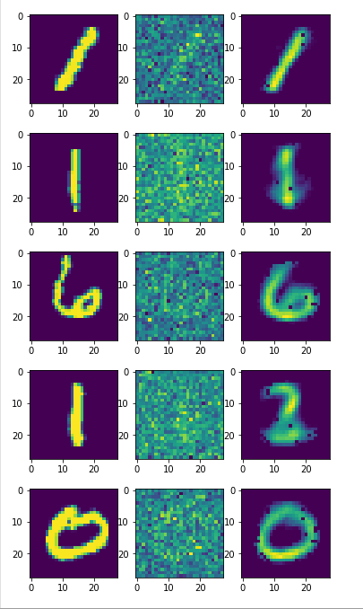
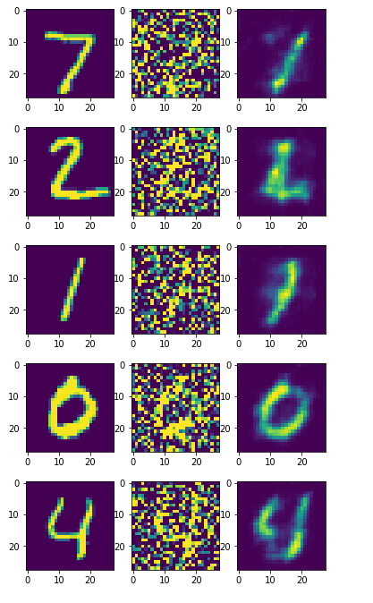

# Autoencoders

Autoencoder is an unsupervised artificial neural network that learns how to efficiently compress and encode data then learns how to reconstruct the data back from the reduced encoded representation (latent vector) to a representation that is as close to the original input as possible. It's major task is to perform dimensionality reduction.

### Variational autoencoder

Variational Autoencoders are generative models that learn the mean and standard deviation from the data distribution in order to create a continuos latent vector. This helps in creating smooth images with easy interpolation

- Dataset - MNIST 
- Used Latent Vector dimension = 2, Hidden dimension = 512, learning rate = 0.001
- Loss Function :- Binary Cross Entropy function + KL Divergence 
- Training Loss - 180.56

 Output:-
 
 
 
 
  - Observations  
 The model is able is to correctly produce 0,1,3,7 digts.  
 There is an ambiguity between 4 and 9, 3 and 8, 5 and 6.
 
 ### Denoising Autoencoder
Denoising autoencoders attempt to address identity-function risk by randomly corrupting input (i.e. introducing noise) that the autoencoder must then reconstruct, or denoise.

- Dataset - MNIST
- Loss function - Mean squared error between the original image and reconstructed image
- Training loss - 0.05

MLP-DAE output

 

CNN-DAE output

 
 - 
 
