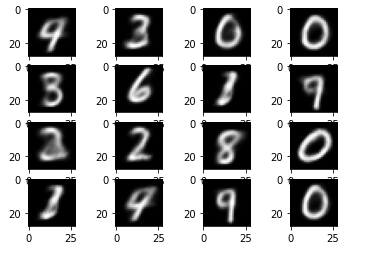

# Autoencoders

### Variational autoencoder
- MNIST dataset 
- Used Latent Vector dimension = 2, Hidden dimension = 512, learning rate = 0.001
- Loss Function :- Binary Cross Entropy function + KL Divergence 
- Training Loss - 180.56

 Output:-
 
 
 
 
  - Observations
 The model is able is to correctly produce 0,1,3,7 digts.
 There is an ambiguity between 4 and 9, 3 and 8, 5 and 6
 
 ### Denoising Autoencoder
 
